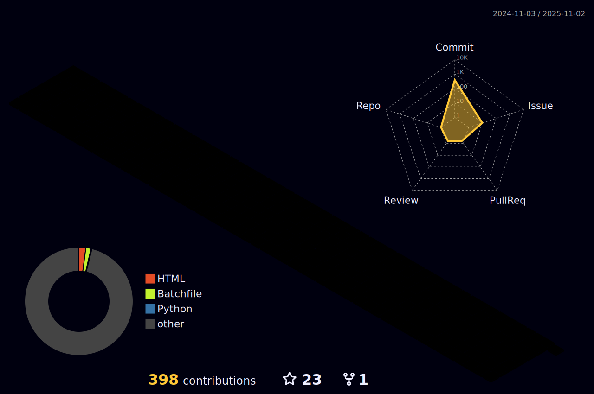

  

 
  <h2>📚STACKS</h2>
  <b>✅프로그래밍언어 </b>
   
  
  
   
  <b>✅웹 개발 </b>
   
   
   
  
  
  
  
   
  <b>✅모바일 개발 </b>
  
  
   
  <b>✅데이터 베이스 </b>
  
   
   
  <b>✅챗봇 및 자연어 처리 </b>
  
   
  <b>✅협업 </b>
  
  
  
   
  <b>✅디자인 </b>
  
  
  
   
  <b>✅문서 </b>
  
   

 
 

  <h2>🌟my Github</h2>
  
  

